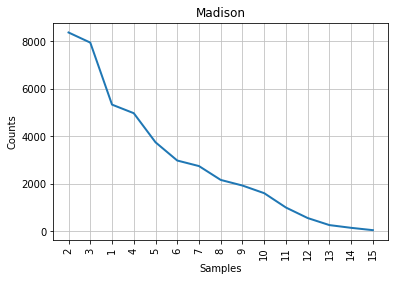
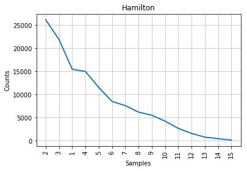
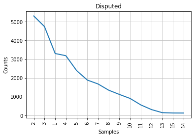
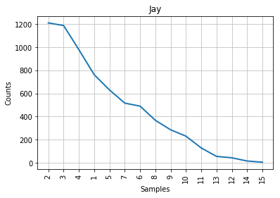
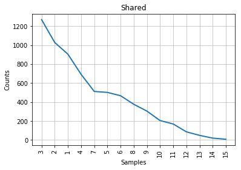

# Stylometry
Distinguishing authors by the style of their writing

In the dataset, 51 papers have been written by Hamilton, 14 by Madison and 4 by Joy.
3 of the papers were co written by Madison and Hamilton and their are 12 disputed papers.

In this project, I have plotted a graph using nltk library based on the word length distribution.

From the givrn graph, we try to analyze who wrote the disputed papers based on the authors style of writing.

The following graphs were generated based on the given dataset:

   
   
   
   
   
 

